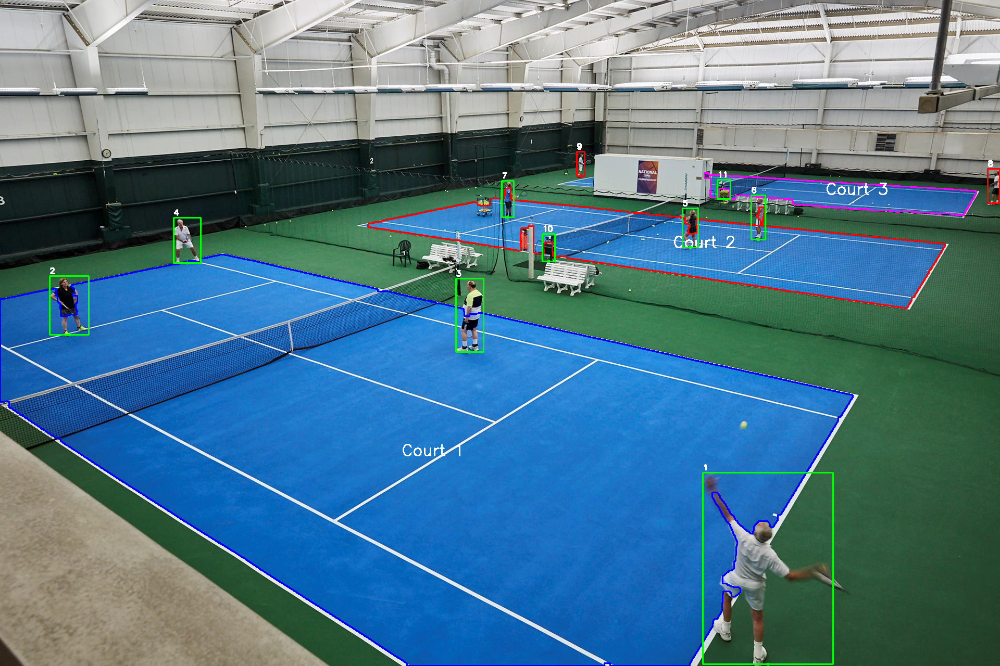

# Tennis Court Detection System


<div align="center">
  
  <p><i>Example tennis court and people detection</i></p>
</div>

## Overview

This advanced computer vision system detects tennis courts and tracks people on them, providing real-time analysis of who is in-bounds or out-of-bounds. Perfect for tennis facilities, coaches, and event organizers who need automated court monitoring with high accuracy and minimal setup.

### Features

- **Court Detection**: Automatically identifies tennis courts using advanced color analysis algorithms
- **People Tracking**: Detects and tracks people using state-of-the-art YOLOv5/YOLOv8 object detection
- **Position Analysis**: Precisely determines if people are in-bounds, on sidelines, or off-court
- **Multi-Court Support**: Numbers each court and tracks people per court automatically
- **Rich Visualization**: Outputs detailed images with color-coded courts and player positions
- **Flexible Configuration**: Highly customizable with easy-to-modify settings
- **Multiple Model Support**: Works with both YOLOv5 and YOLOv8 models for optimal performance

## Quick Start

### Prerequisites

- Python 3.6+
- CUDA-compatible GPU (recommended for faster processing, but not required)
- Required Python packages (installed automatically via instructions below):
  - torch & torchvision
  - opencv-python
  - numpy
  - pandas
  - shapely
  - ultralytics (for YOLOv8 support)
  - tqdm, pillow, matplotlib

### Installation

#### Standard Installation (Windows/Mac/Linux)

1. Clone repository:
   ```bash
   git clone https://github.com/yourusername/tennis-court-detection.git
   cd tennis-court-detection
   ```

2. Create virtual environment (recommended):
   ```bash
   python -m venv venv
   source venv/bin/activate  # On Windows: venv\Scripts\activate
   ```

3. Install the dependencies:
   ```bash
   pip install -r requirements.txt
   ```

4. Install YOLOv8 support (optional but recommended for better detection):
   ```bash
   python install_ultralytics.py
   ```

#### Raspberry Pi Installation

For Raspberry Pi, we provide an optimized installation script:

1. Clone repository:
   ```bash
   git clone https://github.com/yourusername/tennis-court-detection.git
   cd tennis-court-detection
   ```

2. Run the Raspberry Pi installer script:
   ```bash
   chmod +x setup_linux.sh
   ./setup_linux.sh
   ```

### Running the System

#### Basic Usage

1. Place a tennis court image in the `images` folder with the name `input.png`
2. Run the script:
   ```bash
   python main.py
   ```
3. Find the output in `images/output.png`

#### Using a Custom Image

Run with a specific input image:
```bash
python main.py --input path/to/your/image.jpg
```

#### Using YOLOv8 for Better Detection

The system now supports YOLOv8 which provides better detection accuracy:
```bash
python main.py --model yolov8x
```

#### Specify Output Location

Save the result to a custom location:
```bash
python main.py --output path/to/save/result.png
```

#### Raspberry Pi Specific

On Raspberry Pi, use python3 explicitly:
```bash
python3 main.py --input images/your_tennis_court.jpg
```

For better performance on Raspberry Pi, you can use:
```bash
python3 main.py --device cpu --model yolov5s
```

## Command-Line Arguments

The system supports various command-line arguments for customization:

| Argument | Description | Default |
|----------|-------------|---------|
| `--input` | Path to input image | `images/input.png` |
| `--output` | Path for output image | `images/output.png` |
| `--model` | YOLO model to use (`yolov5s`, `yolov5m`, `yolov8n`, `yolov8s`, `yolov8x`, etc.) | `yolov8x` |
| `--debug` | Enable debug mode with additional outputs | `False` |
| `--quiet` | Reduce console output | `False` |
| `--show-labels` | Show detailed labels on output image | `False` |
| `--show-court-labels` | Show court numbers on output image | `False` |
| `--device` | Device to use for inference (`cpu` or `cuda`) | auto-detect |
| `--disable-ssl-verify` | Disable SSL verification for downloads | `False` |
| `--extra-verbose` | Show detailed detection information | `False` |

### Example Commands

#### Process a single image with YOLOv8x (recommended)
```bash
python main.py --model yolov8x
```

#### Process a specific image with custom output path
```bash
python main.py --input my_courts.png --output results.png --model yolov8x
```

#### Enable debug mode for additional visualization outputs
```bash
python main.py --debug
```

#### Show detailed labels on the output image
```bash
python main.py --show-labels
```

## Troubleshooting

### Common Issues and Solutions

#### YOLOv8 Installation Issues
If you're having trouble with YOLOv8 models:
```bash
python install_ultralytics.py
```
This will install the ultralytics package needed for YOLOv8 models.

#### Module Not Found Errors
If you encounter "No module named X" errors:
```bash
pip install -r requirements.txt
```

#### YOLOv5/YOLOv8 Model Missing
If you get a model missing error:
```bash
# For YOLOv5
mkdir -p models
curl -L https://github.com/ultralytics/yolov5/releases/download/v6.0/yolov5s.pt -o models/yolov5s.pt

# For YOLOv8 
mkdir -p models
curl -L https://github.com/ultralytics/assets/releases/download/v0.0.0/yolov8x.pt -o models/yolov8x.pt
```

#### CUDA / Memory Errors
If you encounter CUDA out-of-memory errors:
```bash
python main.py --device cpu
```
Or try a smaller model:
```bash
python main.py --model yolov8s  # or yolov8n for even smaller
```

#### SSL Certificate Errors
If you encounter SSL verification issues:
```bash
python main.py --disable-ssl-verify
```

### Court Detection Issues

- **Sky detected as courts**: Adjust the green threshold check
- **Courts not detected**: Modify HSV ranges in `Config.COURT_COLORS` to match your court colors
- **Courts merged together**: Make sure the green areas between courts are visible

### People Detection Issues

- **Missing detections**: Lower detection threshold by using `--model yolov8x` which has better detection capabilities
- **Wrong position classification**: Use `--debug` to check color masks

## Supported YOLO Models

The system supports multiple YOLO models with different performance characteristics:

| Model | Size | Speed | Accuracy | Memory Usage |
|-------|------|-------|----------|-------------|
| yolov5n | 6.6MB | Very Fast | Low | Very Low |
| yolov5s | 14.3MB | Fast | Medium | Low |
| yolov5m | 42.6MB | Medium | Good | Medium |
| yolov5l | 92.8MB | Slow | Better | High |
| yolov5x | 174.5MB | Very Slow | Best | Very High |
| yolov8n | 6.3MB | Very Fast | Medium | Very Low |
| yolov8s | 22.5MB | Fast | Good | Low |
| yolov8m | 52.0MB | Medium | Very Good | Medium |
| yolov8l | 86.5MB | Slow | Excellent | High |
| yolov8x | 136.5MB | Very Slow | Superior | Very High |

For most applications, `yolov8x` offers the best detection results, while `yolov5s` is a good compromise for slower devices.

## Debug Mode

When running with the `--debug` flag, the system generates visualizations in the `images/debug/` directory:

- **blue_mask_raw.png**: Raw blue court area detection
- **green_mask.png**: Green out-of-bounds area detection
- **filtered_court_mask.png**: Filtered court mask after processing
- **courts_numbered.png**: Courts with assigned numbers
- **foot_positions_debug.png**: Debug visualization of detected people's positions
- **color_masks.png**: Combined visualization of all color masks

These visualizations are invaluable for troubleshooting detection issues.

## License

This project is licensed under the MIT License - see the LICENSE file for details.

---

<div align="center">
  <p>Made with ❤️ for tennis enthusiasts</p>
</div>